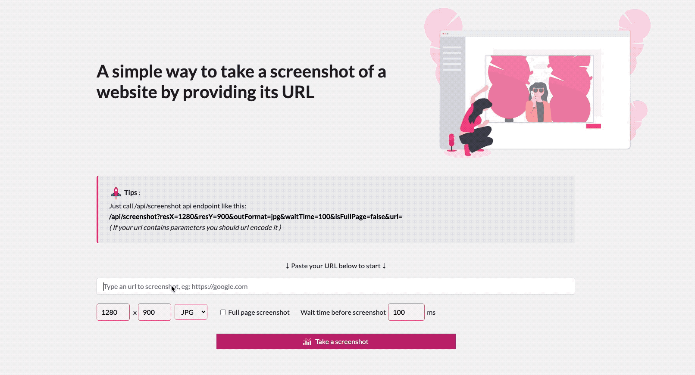

# ws-screenshot CI/CD pipeline

Deploy ws-screenshot with CI/CD on Elestio

 
 

# Once deployed ...

You can open ws-screenshot UI here:

    URL: https://[CI_CD_DOMAIN]
    login: "root"
    password: [ADMIN_PASSWORD]

# Usage

## REST API

Make a GET request (or open the url in your browser):

    https://[CI_CD_DOMAIN]/api/screenshot?resX=1280&resY=900&outFormat=jpg&isFullPage=false&url=https://vms2.terasp.net&headers={"foo":"bar"}

## Websocket API

    var event = {
        cmd: "screenshot",
        url: url,
        originalTS: (+new Date()),
        resX: resX,
        resY: resY,
        outFormat: outFormat,
        isFullPage: isFullPage,
        headers: {
            foo: 'bar'
        }
    };

You can check /public/js/client.js and /public/index.html for a sample on how to call the Websocket API

# Supported parameters

- url: full url to screenshot, must start with http:// or https://
- resX: integer value for screen width, default: 1280
- resY: integer value for screen height, default: 900
- outFormat: output format, can be jpg, png or pdf, default: jpg
- isFullPage: true or false, indicate if we should scroll the page and make a full page screenshot, default: false
- waitTime: integer value in milliseconds, indicate max time to wait for page resources to load, default: 100
- headers: add extra headers to the request

# Protect with an ApiKey

You can protect the REST & WS APIs with an ApiKey, this is usefull if you want to protect your screenshot server from being used by anyone To do that, open appconfig.json and set any string like a GUID in ApiKey attribute. This will be your ApiKey to pass to REST & WS APIs

To call the REST API with an ApiKey:

    https://[CI_CD_DOMAIN]/api/screenshot?url=https://example.com&apiKey=XXXXXXXXXXXXX

To call the Websocket API with an ApiKey:

    var event = {
        cmd: "screenshot",
        url: url,
        originalTS: (+new Date()),
        apiKey: "XXXXXXXXXXXXX"
    };

You can check /public/js/client.js for a sample on how to call the Websocket API
